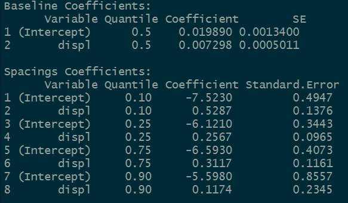
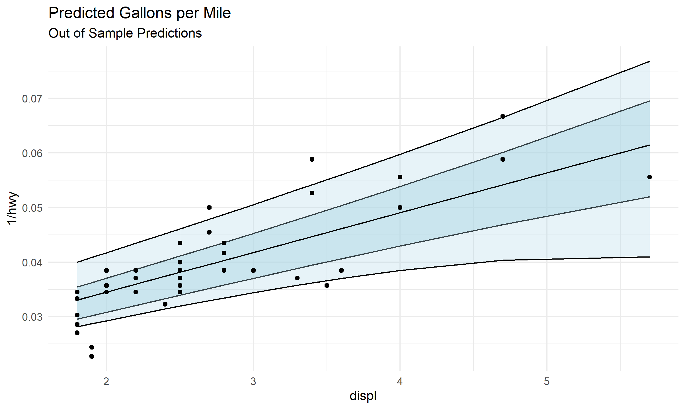
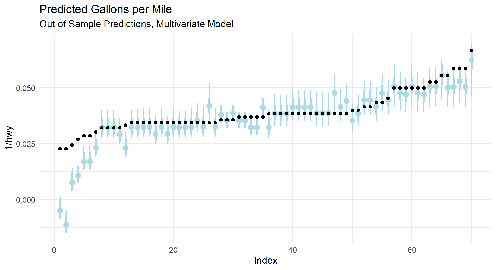
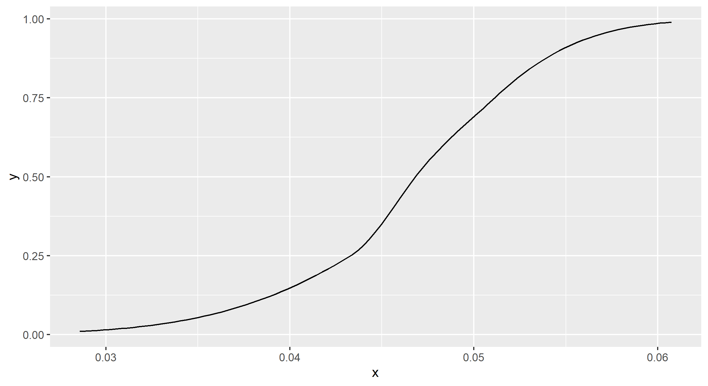

# quantspace
  <!-- badges: start -->
  [](https://github.com/be-green/quantspace/actions)

  [](https://codecov.io/gh/be-green/quantspace?branch=master)
  <!-- badges: end -->

This is an R package for estimating quantile regression coefficients via the quantile spacing method, as described in the paper [Quantile Spacings: A Simple Method for the Joint Estimation of Multiple Quantiles Without Crossing, Schmidt & Zhu](https://papers.ssrn.com/sol3/papers.cfm?abstract_id=2220901).

The package contains utilities for estimating quantiles via the difference from a central estimated quantile. Fitted quantiles are guaranteed to be positive, because instead of directly estimating each quantile, the package will estimate the quantile effect on the log of the residuals with the correct corresponding sign.

In other words, imagine we estimate the median quantile for the data. Now we are interested in the 75th percentile. But we don't want our quantiles to cross, which they are guaranteed to do in a non-trivial linear model (just expand the line far enough--if the lines aren't parallel, they will cross). What do we do? We take the log of the residuals relative to the median, and estimate a quantile regression on that quantity. The exponential model guarantees that the fitted quantile will have a positive difference vs. the median. You can translate the spacing back to a fitted quantile by taking the implied `predicted_spacing = log(75% - median)` by running `median + exp(predicted_spacing)`. The effects on each quantile are non-linear, but it avoids the crossing problem.

Once we have a fitted model, the package also contains utilities for interpolating the density implied by the fitted quantiles. It does this with two steps--first it takes the highest and lowest fitted quantiles (0.95 and 0.05 by default) and uses a parametric assumption to fit the tails (gaussian by default). Then it uses cubic splines to interpolate the fitted quantiles, giving a continuous predictive distribution.

Standard errors are estimated via the weighted bootstrap, where the data is randomly re-weighted according to an exponential distribution with rate parameter 1. There are also closed-form approximate standard errors through the delta method, though this is still on the roadmap and is not integrated into the package. There is also support for clustered standard errors via clustered subsampling. This is technically available through the formula interface, but the interface for this functionality is guaranteed to change in the near future.

# Installation

You'll need R installed on your computer run the package. To install, the easiest method is to run 

```
remotes::install_github("be-green/quantspace")
```

which requires the `remotes` package. `quantspace` also has some code which must be compiled.

## Compiling on Windows

On windows that requires the installation of [Rtools](https://cran.r-project.org/bin/windows/Rtools/). For versions of R >= 4.0, you must use `rtools40`, and [the older rtools](https://cran.r-project.org/bin/windows/Rtools/history.html) for versions before 4.0. 

## Compiling on Mac
On a mac, you will require a C++ compiler, a `gfortran` binary and the like. While you can install these things via terminal + homebrew, the easiest way is to use the [toolchain installer](https://github.com/rmacoslib/r-macos-rtools#how-do-i-use-the-installer). 

## Compiling on Linux

On most linux distributions, you shouldn't have to do anything special. You will still need a `C++` compiler installed, but usually something like `g++` is already available. On some Redhat linux server systems you will need to enable developer tools for your session before building. You can do this like so:

1. Open a terminal window
2. `scl enable devtoolset-x bash` where `x` is replaced with the version of devtools available to your redhat system
3. Boot up R and install the package

## Performance benefits for `agd`

One of the algorithms (agd) available for fitting quantile regressions in the `quantspace` package uses the `Armadillo` C++ library for linear algebra. This library is able to leverage high-speed linear algebra packages such as [openblas](https://www.openblas.net/) or the [Intel MKL libraries](https://software.intel.com/content/www/us/en/develop/documentation/get-started-with-mkl-for-dpcpp/top.html).

# Basic Usage

Say we want to run a quantile regression. The easiest way to do this is to use the `qs` function.

```
library(quantspace)
data(mpg)

est <- qs(1/hwy ~ displ, 
          data = head(mpg, 190))
```

If we print our estimate, we'll see the baseline coefficients (in this case the median is chosen as the central quantile), and then the spacings coefficients. 



Suppose we want to see how good our fit is? We might want out of sample predictive tests. To do this, we simply run

```
oos_pred <- predict(est, newdata = tail(mpg, 70))
```


Let's plot some of this stuff to see how it looks!
```
library(ggplot2)
plot_data <- data.frame(tail(mpg, 70),
                        oos_pred)
                        

ggplot(plot_data, 
       aes(x = displ, y = 1/hwy, ymin = `0.25`, ymax = `0.75`)) +
  geom_ribbon(fill = "lightblue", alpha = 0.5, color = "black") +
  geom_ribbon(aes(ymin = `0.1`, ymax = `0.9`),
              fill = "lightblue", alpha = 0.3, color = "black") +
  geom_point() +
  geom_line(aes(y = `0.5`), color = "black") +
  theme_minimal() +
  ggtitle("Predicted Gallons per Mile",
          subtitle = "Out of Sample Predictions")
 ```
 


Let's try a multivariate model, with multiple X variables. To make the predictions easier to see, I'm going to sort the true values, and plot our predicted quantiles as point-ranges, with the fatter range representing the 50% interval, and the thin one representing the 80% interval.

```

est <- qs(1/hwy ~ displ + cty, 
          data = head(mpg, 190))

oos_pred <- predict(est, newdata = tail(mpg, 70))

plot_data <- data.table(tail(mpg, 70),
                        oos_pred)
setorder(plot_data, -hwy)
plot_data[,Index := .I]

ggplot(plot_data, 
       aes(x = Index, y = 1/hwy, ymin = `0.25`, ymax = `0.75`)) +
  geom_pointrange(aes(y = `0.5`), color = "lightblue", size = 1.1,
                  fatten = 1) +
  geom_pointrange(aes(y = `0.5`, ymin = `0.1`, ymax = `0.9`),
                  color = "lightblue") +
  geom_point() +
  theme_minimal() +
  ggtitle("Predicted Gallons per Mile",
          subtitle = "Out of Sample Predictions, Multivariate Model")
```


Looks like we are missing some aspect of the problem for the lowest gallons-per-mile of car--perhaps we need to include an additional covariate. This type of model diagnostic is helpful, since the 80% interval for the fitted quantile should contain the observed value 80% of the time. If that's happening not-at-random, or not happening it might be time to check your model.

# Distributional Effects

What if we want to interpolate the fitted quantiles? For example, a full changes-in-changes difference in difference model involves the cumulative distribution function of the treated vs. the counterfactual predicted by the control group. We can do that by interpolating the fitted distributions for each group. Or maybe you just want a full predictive density to predict with/evaluate/sample from. 

Let's start with the fitted model above. To interpolate the fitted quantiles, all you need to do is run the following.

```
de <- distributional_effects(est)
```

By default this estimates the conditional distribution at the average level of the covariates, but you can specify the `newdata` argument, which will compute the density functions for the levels of the data you provide.

Now `de` is an object of class "distributional_effects" which has associated plotting methods. I think that a `predict` interface is going to be on the roadmap for future releases since it will be relatively easy to program.

The object itself is a list of 4 functions corresponding to the pdf, the cdf, the quantile function, and a random number generator which simulates from the fitted density. Let's draw 100 random numbers from our fitted density.

```
de$r(100)
```

That was pretty easy! We can also plot the pdf, cdf, or quantile function.

```
plot(de, what = "cdf")
```



# Marginal Effects

TBD, this interface exists but it would be generous to call it experimental.


