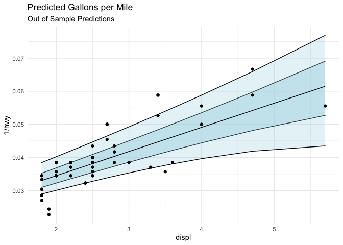
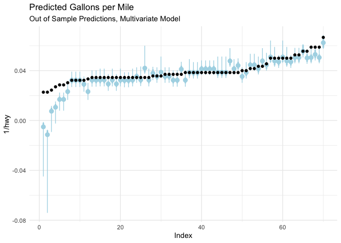

# quantspace

<!-- badges: start -->

[](https://github.com/be-green/quantspace/actions)
[](https://codecov.io/gh/be-green/quantspace?branch=master)
<!-- badges: end -->

This is an R package for estimating quantile regression coefficients via
the quantile spacing method, as described in the paper [Quantile
Spacings: A Simple Method for the Joint Estimation of Multiple Quantiles
Without Crossing, Schmidt &
Zhu](https://papers.ssrn.com/sol3/papers.cfm?abstract_id=2220901).

The package allows users to fit quantile regressions and predictive distributions 
in a manner which avoids the quantile crossing problem. Fitted quantiles are
guaranteed to be positive, because instead of directly estimating each
quantile, the package will estimate the quantile effect on the log of
the residuals with the correct corresponding sign.

In other words, imagine we estimate the median quantile for the data.
Now we are interested in the 75th percentile. But we don’t want our
quantiles to cross, which they are guaranteed to do in a non-trivial
linear model (if the lines aren’t
parallel, they will cross). To avoid this problem, the package 
take the log of the
residuals relative to the median, and estimates a linear quantile regression on
that quantity. The exponential model guarantees that the fitted quantile
will have a non-negative difference vs. the median. You can translate the
spacing back to a fitted quantile by taking the spacing predicted by the model,
exponentiating, and adding back to the median.

The package also contains utilities for
interpolating the density implied by the fitted quantiles. It does this
in two steps–first it takes the highest and lowest fitted quantiles
(0.95 and 0.05 by default) and uses a parametric assumption to fit the
tails (gaussian by default), and then uses cubic splines to interpolate
the fitted quantiles, giving a continuous predictive distribution.

The package is flexible, and works with any number of algorithms. It contains
specialized methods for large-scale data, which use a smoothed approximation 
of the quantile loss function, combined with accelerated gradient descent, to
estimate models at scales beyond the scope of traditional methods.

# Installation

You’ll need R installed on your computer run the package. To install,
the easiest method is to run

    remotes::install_github("be-green/quantspace")

which requires the `remotes` package. `quantspace` also has some code
which must be compiled.

## Compiling on Windows

On windows that requires the installation of
[Rtools](https://cran.r-project.org/bin/windows/Rtools/). For versions
of R &gt;= 4.0, you must use `rtools40`, and [the older
rtools](https://cran.r-project.org/bin/windows/Rtools/history.html) for
versions before 4.0.

## Compiling on Mac

On a mac, you will require a C++ compiler, a `gfortran` binary and the
like. While you can install these things via terminal + homebrew, the
easiest way is to use the [toolchain
installer](https://github.com/rmacoslib/r-macos-rtools#how-do-i-use-the-installer).

## Compiling on Linux

On most linux distributions, you shouldn’t have to do anything special.
You will still need a `C++` compiler installed, but usually something
like `g++` is already available. On some Redhat linux server systems you
will need to enable developer tools for your session before building.
You can do this like so:

1.  Open a terminal window
2.  `scl enable devtoolset-x bash` where `x` is replaced with the
    version of devtools available to your redhat system
3.  Boot up R and install the package

## Performance benefits for `agd`

One of the algorithms (agd) available for fitting quantile regressions
in the `quantspace` package uses the `Armadillo` C++ library for linear
algebra. This library is able to leverage high-speed linear algebra
packages such as [openblas](https://www.openblas.net/) or the [Intel MKL
libraries](https://software.intel.com/content/www/us/en/develop/documentation/get-started-with-mkl-for-dpcpp/top.html).

The AGD method uses a Nesterov-smoothed accelerated gradient descent approach, where a window around the origin is smoothed w/ a least squares objective function. It currently leverages the step-size selection method from the [conquer package](https://github.com/XiaoouPan/conquer) and was based substantially on their gradient descent code.

# Basic Usage

Say we want to run a quantile regression. The easiest way to do this is
to use the `qs` function.

``` r
library(quantspace)
#> Loaded quantspace v0.1, using 6 cores for bootstrap sampling (see ?getCores).
#> Bug reports: github.com/be-green/quantspace/issues
library(ggplot2)
data(mpg)

est <- qs(1/hwy ~ displ, 
          data = head(mpg, 190))
```

If we print our estimate, we’ll see the baseline coefficients (in this
case the median is chosen as the central quantile), and then the
spacings coefficients.

``` r
est
#> Baseline Coefficients:
#>       Variable Quantile Coefficient        SE
#> 1 (Intercept)      0.5    0.019890 0.0013340
#> 2       displ      0.5    0.007298 0.0004935 
#> 
#> Spacings Coefficients:
#>       Variable Quantile Coefficient Standard.Error
#> 1 (Intercept)     0.10     -6.8980         0.9711
#> 2       displ     0.10      0.3881         0.2463
#> 3 (Intercept)     0.25     -6.8500         0.4917
#> 4       displ     0.25      0.3711         0.1228
#> 5 (Intercept)     0.75     -6.6770         0.4730
#> 6       displ     0.75      0.3151         0.1240
#> 7 (Intercept)     0.90     -6.1480         1.0420
#> 8       displ     0.90      0.2271         0.2829
```

Suppose we want to see how good our fit is? We might want out of sample
predictive tests. To do this, we simply run

``` r
oos_pred <- predict(est, newdata = tail(mpg, 70))
```

Let’s plot some of this stuff to see how it looks!

``` r
library(ggplot2)
plot_data <- data.frame(tail(mpg, 70),
                        oos_pred)

ggplot(plot_data, 
       aes(x = displ, y = 1/hwy, ymin = `X0.25`, ymax = `X0.75`)) +
  geom_ribbon(fill = "lightblue", alpha = 0.5, color = "black") +
  geom_ribbon(aes(ymin = `X0.1`, ymax = `X0.9`),
              fill = "lightblue", alpha = 0.3, color = "black") +
  geom_point() +
  geom_line(aes(y = `X0.5`), color = "black") +
  theme_minimal() +
  ggtitle("Predicted Gallons per Mile",
          subtitle = "Out of Sample Predictions")
```



Let’s try a multivariate model, with multiple X variables. To make the
predictions easier to see, I’m going to sort the true values, and plot
our predicted quantiles as point-ranges, with the fatter range
representing the 50% interval, and the thin one representing the 80%
interval.

``` r
est <- qs(1/hwy ~ displ + cty, 
          data = head(mpg, 190))

oos_pred <- predict(est, newdata = tail(mpg, 70))

plot_data <- data.frame(tail(mpg, 70),
                        oos_pred)

plot_data <- plot_data[order(-plot_data$hwy),]

plot_data$Index <- 1:nrow(plot_data)

ggplot(plot_data, 
       aes(x = Index, y = 1/hwy, ymin = `X0.25`, ymax = `X0.75`)) +
  geom_pointrange(aes(y = `X0.5`), color = "lightblue", size = 1.1,
                  fatten = 1) +
  geom_pointrange(aes(y = `X0.5`, ymin = `X0.1`, ymax = `X0.9`),
                  color = "lightblue") +
  geom_point() +
  theme_minimal() +
  ggtitle("Predicted Gallons per Mile",
          subtitle = "Out of Sample Predictions, Multivariate Model")
```



Looks like we are missing some aspect of the problem for the lowest
gallons-per-mile of car–perhaps we need to include an additional
covariate. This type of model diagnostic is helpful, since the 80%
interval for the fitted quantile should contain the observed value 80%
of the time. If that’s happening not-at-random, or not happening it
might be time to check your model.

# Distributional Effects

What if we want to interpolate the fitted quantiles? For example, a full
changes-in-changes difference in difference model involves the
cumulative distribution function of the treated vs. the counterfactual
predicted by the control group. We can do that by interpolating the
fitted distributions for each group. Or maybe you just want a full
predictive density to predict with/evaluate/sample from.

Let’s start with the fitted model above. To interpolate the fitted
quantiles, all you need to do is run the following.

``` r
de <- distributional_effects(est)
```

By default this estimates the conditional distribution at the average
level of the covariates, but you can specify the `newdata` argument,
which will compute the density functions for the levels of the data you
provide.

Now `de` is an object of class “distributional\_effects” which has
associated plotting methods. I think that a `predict` interface is going
to be on the roadmap for future releases since it will be relatively
easy to program.

The object itself is a list of 4 functions corresponding to the pdf, the
cdf, the quantile function, and a random number generator which
simulates from the fitted density. Let’s draw 10 random numbers from our
fitted density.

``` r
de$r(10)
#>  [1] 0.05397541 0.04655421 0.04505485 0.04704032 0.05438701 0.04198281
#>  [7] 0.04158249 0.04753504 0.04674888 0.04402587
```

# Marginal Effects

You can evaluate marginal effects with the function `marginal_effects`, which contains methods for average marginal effects, marginal effects at the average, and marginal effects as they vary across levels of a variable.
